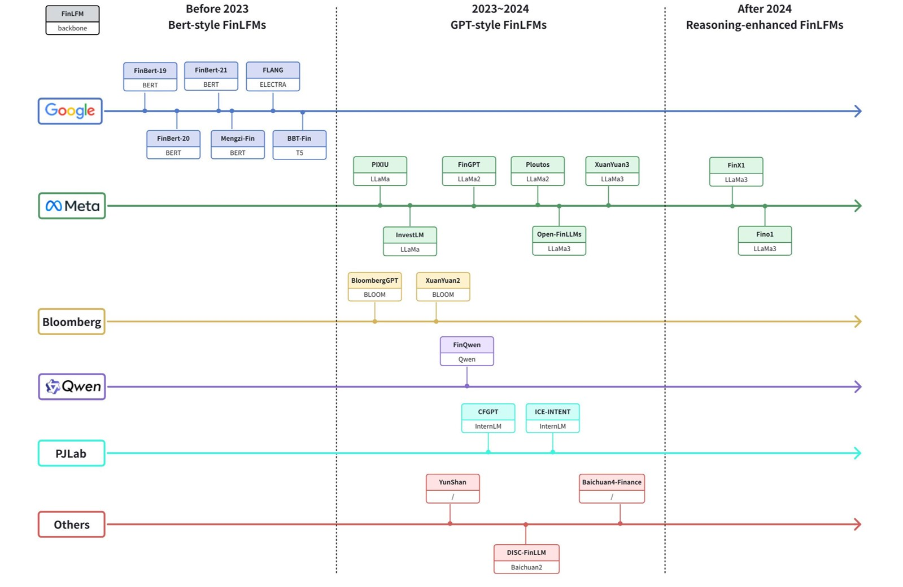

# Advancing Financial Engineering with Financial Foundation Models: Progress, Applications, and Challenges

  
**A Survey on Financial Foundation Models**  

  

## 📖 Table of contents
- [Awesome Papers](#awesome-papers)
  - [Financial Foundation Models](#Financial-Foundation-Models)
    - [ Financial Language Foundation Models](#Financial-Language-Foundation-Models)
      - [ Bert-style FinLFMs](#Bert-style-FinLFMs)
      - [ GPT-style FinLFMs](#GPT-style-FinLFMs)
      - [Reasoning-enhanced FinLFMs](#Reasoning-enhanced-FinLFMs)
    - [ Financial Time-Series Foundation Models](#Financial-Time-Series-Foundation-Models)
      - [Naive FinTSFMs Trained from Scratch](#Naive-FinTSFMs-Trained-from-Scratch)
      - [FinTSFMs Adapted from Language Models](#FinTSFMs-Adapted-from-Language-Models)
    - [Financial Visual-Language Foundation Models](#Financial-Visual-Language-Foundation-Models)
  - [Financial Data](#Financial-Data)
    - [Financial text-based Datasets](#Financial-text-based-Datasets)
      - [Task-specific and English-centric Datasets](#Task-specific-and-English-centric)
      - [Multi-task Integration and Language Expansion Datasets](#Multi-task-Integration-and-Language-Expansion)
      - [Cross-lingual and Real-world Benchmarks](#Cross-lingual-and-Real-world-Benchmarks)
    - [Financial time-series-related Datasets](#Financial-time-series-related-Datasets)
    - [Financial Visual-Language-related Datasets](#Financial-Visual-Language-related-Datasets)
  - [ FFM-based Financial Applications](#FFM-based-Financial-Applications)
    - [Financial Data Structuring](#Financial-Data-Structuring)
    - [Market Prediction](#Market-Prediction)
    - [Trading and Financial Decision](#Trading-and-Financial-Decision)
    - [Multi-Agent Systems](#Multi-Agent-Systems)

# Awesome Papers
## Financial Foundation Models
### Financial Language Foundation Models
#### Bert-style FinLFMs
[1] [FinBERT: Financial Sentiment Analysis with Pretrained Language Models](https://arxiv.org/pdf/1908.10063) arXiv e-prints.

[2] [Finbert: A pretrained language model for financial communications.](https://arxiv.org/pdf/2006.08097) arXiv e-prints.

[3] [Finbert: A pre-trained financial language representation model for financial text mining](https://arxiv.org/pdf/2006.08097https://www.ijcai.org/proceedings/2020/0622.pdf) IJCAI 2020.

[4] [Mengzi: Towards Lightweight yet Ingenious Pre-trained Models for Chinese](https://arxiv.org/pdf/2110.06696) arXiv e-prints.

[5] [WHEN FLUE MEETS FLANG: Benchmarks and Large Pre-trained Language Model for Financial Domain](https://arxiv.org/pdf/2211.00083) arXiv e-prints.

[6] [BBT-Fin: Comprehensive Construction of Chinese Financial Domain Pre-trained Language Model, Corpus and Benchmark](https://arxiv.org/pdf/2302.09432) arXiv e-prints.

#### GPT-style FinLFMs
[1] [PIXIU: A Large Language Model, Instruction Data and Evaluation Benchmark for Finance](https://arxiv.org/pdf/2306.05443) arXiv e-prints.[code](https://github.com/The-FinAI/PIXIU)

[2] [BloombergGPT:A Large Language Model for Finance](https://arxiv.org/pdf/2303.17564) arXiv e-prints.

[3] [InvestLM: A Large Language Model for Investment using Financial Domain Instruction Tuning](https://arxiv.org/pdf/2309.13064) arXiv e-prints.[code](https://github.com/AbaciNLP/InvestLM)

[4] [Xuanyuan 2.0: A large chinese financial chat model with hundreds of billions parameters](https://doi.org/10.1145/3583780.3615285) CIKM 2023.[code](https://github.com/Duxiaoman-DI/XuanYuan)

[5] [PanGu-𝜋:Enhancing Language Model Architectures via Nonlinearity Compensation](https://arxiv.org/pdf/2306.05443) arXiv e-prints.

[6] [Finqwen: Ai+finance](https://github.com/Tongyi-EconML/FinQwen).[code](https://github.com/Tongyi-EconML/FinQwen)

[7] [Fingpt: Open-source financial large language models](https://arxiv.org/pdf/2306.06031) arXiv e-prints.[code](https://github.com/AI4Finance-Foundation/FinGPT)

[8] [Ploutos: Towards interpretable stock movement prediction with financial large language model](https://arxiv.org/pdf/2403.00782) arXiv e-prints.

[9] [Open-FinLLMs: Open Multimodal Large Language Models for Financial Applications](https://arxiv.org/pdf/2408.11878) arXiv e-prints.[code](https://anonymous.4open.science/r/PIXIU2-0D70/B1D7/LICENSE)

[10] [Baichuan4-Finance Technical Report](https://arxiv.org/pdf/2412.15270) arXiv e-prints.

[11] [Disc-finllm: A chinese financial large language model based on multiple experts fine-tuning](https://arxiv.org/pdf/2310.15205) arXiv e-prints.[code](https://github.com/FudanDISC/DISC-FinLLM)

[12] [Cfgpt: Chinese financial assistant with large language model](https://arxiv.org/pdf/2309.10654) arXiv e-prints.[code](https://github.com/TongjiFinLab/CFGPT)

[13] [No Language is an Island: Unifying Chinese and English in Financial Large Language Models, Instruction Data, and Benchmarks](https://arxiv.org/pdf/2403.06249) arXiv e-prints.[code](https://github.com/YY0649/ICE-PIXIU)

#### Reasoning-enhanced FinLFMs
[1] [Xuanyuan-finx1](https://github.com/Duxiaoman-DI/XuanYuan#XuanYuan-FinX1-Preview).[code](https://github.com/Duxiaoman-DI/XuanYuan)

[2] [Fino1: On the Transferability of Reasoning Enhanced LLMs to Finance](https://arxiv.org/pdf/2502.08127) arXiv e-prints.[code](https://github.com/The-FinAI/Fino1)

### Financial Time-Series Foundation Models
#### Naive FinTSFMs Trained from Scratch
[1] [Marketgpt: Developing a pretrained transformer (gpt) for modeling financial time series](https://arxiv.org/pdf/2411.16585) arXiv e-prints.[code](https://github.com/aaron-wheeler/MarketGPT)

[2] [A decoder-only foundation model for time-series forecasting](https://arxiv.org/abs/2310.10688) ICML 2024.[code](https://huggingface.co/google/timesfm-1.0-200m)

[3] [Financial fine-tuning a large time series model](https://arxiv.org/pdf/2412.09880) arXiv e-prints.[code](https://github.com/pfnet-research/timesfm_fin)

[4] [Dual adaptation of time-series foundation models for financial forecasting](https://openreview.net/attachment?id=SSdBpVNYxd&name=pdf) ICML Workshop FMSD.

#### FinTSFMs Adapted from Language Models
[1] [Time-llm: Time series forecasting by reprogramming large language models](https://arxiv.org/pdf/2310.01728) arXiv e-prints.[code](https://github.com/KimMeen/Time-LLM)

[2] [Unitime: A language-empowered unified model for crossdomain time series forecasting](https://dl.acm.org/doi/pdf/10.1145/3589334.3645434)ACM WEB 2024.[code](https://github.com/liuxu77/UniTime)

[3] [Sociodojo: Building lifelong analytical agents with real-world text and time series](https://openreview.net/pdf?id=xuY33XhEGR)ICLR 2024.[code](https://github.com/chengjunyan1/SocioDojo)

### Financial Visual-Language Foundation Models
[1] [Finvis-gpt: A multimodal large language model for financial chart analysis](https://arxiv.org/pdf/2308.01430) arXiv e-prints.[code](https://github.com/wwwadx/FinVis-GPT)

[2] [Fintral: A family of gpt-4 level multimodal financial large language models](https://arxiv.org/pdf/2402.10986) arXiv e-prints.[code](https://github.com/UBC-NLP/fintral)

[3] [Open-FinLLMs: Open Multimodal Large Language Models for Financial Applications](https://arxiv.org/pdf/2408.11878) arXiv e-prints.[code](https://www.thefin.ai/model/open-finllms)

## Financial Data
### Financial text-based Datasets
#### Task-specific and English-centric Datasets

[1] [Good debt or bad debt: Detecting semantic orientations in economic texts](https://www.semanticscholar.org/paper/Good-debt-or-bad-debt%3A-Detecting-semantic-in-texts-Malo-Sinha/4211bff1388da30a3b7dfd35d6aef2032900ca5c?p2df) JASIST 2014.[data](https://huggingface.co/datasets/takala/financial_phrasebank)

[2] [Domain adaption of named entity recognition to support credit risk assessment](https://aclanthology.org/U15-1010.pdf) ALTA 2015.[data](http://people.eng.unimelb.edu.au/tbaldwin/resources/finance-sec/)

[3] [Www’18 open challenge: Financial opinion mining and question answering](https://dl.acm.org/doi/pdf/10.1145/3184558.3192301) WWW 2018.[data](https://sites.google.com/view/fiqa/home)

[4] [Stock movement prediction from tweets and historical price](http://anthology.aclweb.org/attachments/P/P18/P18-1183.Presentation.pdf) ACL 2018. [data](https://github.com/yumoxu/stocknet-dataset)

[5] [Hybrid deep sequential modeling for social text-driven stock prediction](https://doi.org/10.1145/3269206.3269290) CIKM 2018.[data](https://github.com/wuhuizhe/CHRNN)

[6] [Impact of news on the commodity market: Dataset and results](https://link.springer.com/chapter/10.1007/978-3-030-73103-8_41) FICC 2021.[data](https://www.kaggle.com/datasets/daittan/gold-commodity-news-and-dimensions)

[7] [Fintral: A family of gpt-4 level multimodal financial large language model](https://arxiv.org/pdf/2402.10986) arXiv e-prints.[data](https://github.com/czyssrs/ConvFinQA)

#### Multi-task Integration and Language Expansion Datasets

[1] [WHEN FLUE MEETS FLANG: Benchmarks and Large Pre-trained Language Model for Financial Domain](https://arxiv.org/pdf/2211.00083) arXiv e-prints.[data](https://github.com/SALT-NLP/FLANG)

[2] [PIXIU: A Large Language Model, Instruction Data and Evaluation Benchmark for Finance](https://arxiv.org/pdf/2306.05443) arXiv e-prints.[data](https://github.com/The-FinAI/PIXIU)

[3] [FinEval: A Chinese Financial Domain Knowledge Evaluation Benchmark for Large Language Models](https://arxiv.org/pdf/2308.09975) arXiv e-prints.[data](https://github.com/SUFE-AIFLM-Lab/FinEval)

[4] [CFBenchmark: Chinese financial assistant benchmark for large language model](https://arxiv.org/pdf/2311.05812) arXiv e-prints.[data](https://github.com/TongjiFinLab/CFGPT/tree/main/benchmark)

[5] [Financeiq: Chinese financial domain knowledge assessment dataset](https://github.com/Duxiaoman-DI/XuanYuan/tree/main/FinanceIQ)[data](https://github.com/Duxiaoman-DI/XuanYuan)

[6] [FinBen: A Holistic Financial Benchmark for Large Language Models](https://arxiv.org/pdf/2402.12659) arXiv e-prints.[data](https://github.com/The-FinAI/PIXIU)

[7] [AlphaFin: Benchmarking Financial Analysis with Retrieval-Augmented Stock-Chain Framework](https://arxiv.org/pdf/2403.12582) arXiv e-prints.[data](https://github.com/AlphaFin-proj/AlphaFin)

[8] [CFinBench: A Comprehensive Chinese Financial Benchmark for Large Language Models](https://arxiv.org/pdf/2407.02301) arXiv e-prints.[data](https://cfinbench.github.io/)

[9] [FLAME: Financial Large-Language Model Assessment and Metrics Evaluation](https://arxiv.org/pdf/2501.06211) arXiv e-prints.[data](https://github.com/FLAME-ruc/FLAME)

#### Cross-lingual and Real-world Benchmarks

[1] [No Language is an Island: Unifying Chinese and English in Financial Large Language Models, Instruction Data, and Benchmarks](https://arxiv.org/pdf/2403.06249) arXiv e-prints.[data](https://github.com/YY0649/ICE-PIXIU)

[2] [A dutch financial large language model](https://arxiv.org/pdf/2410.12835) arXiv e-prints.[data](https://github.com/snoels/fingeit)

[3] [Benchmarking large language models on cflue - a chinese financial language understanding evaluation dataset](https://arxiv.org/pdf/2405.10542) ACL 2024.[data](https://github.com/aliyun/cflue)

[4] [M³finmeeting: Multi-lingual multimodal benchmark for financial meeting understanding](https://arxiv.org/pdf/2406.07890) arXiv e-prints.[data](https://github.com/aliyun/qwen-dianjin)

### Financial time-series-related Datasets

[1] [Google stock prices – training and test data(2012–2017)](https://www.kaggle.com/datasets/vaibhavsxn/google-stock-prices-training-and-test-data)

[2] [S&P 500 historical data (1927–2020)](https://www.kaggle.com/datasets/henryhan117/sp-500-historical-data)

[3] [Modeling long and short-term temporal patterns with deep neural networks](https://arxiv.org/pdf/1703.07015) SIGIR 2018.[data](https://github.com/laiguokun/multivariate-time-series-data)

[4] [Bitcoin daily price time series (2010–2020)](https://www.kaggle.com/datasets/soham1024/bitcoin-time-series-data-till-02082020)

[5] [Fnspid: A comprehensive financial news dataset in time series](https://arxiv.org/pdf/2402.06698) arXiv e-prints.[data](https://huggingface.co/datasets/Zihan1004/FNSPID)

[6] [Fintsb: A comprehensive and practical benchmark for financial time series forecasting](https://arxiv.org/pdf/2502.18834) arXiv e-prints.[data](https://github.com/TongjiFinLab/FinTSBenchmark)

### Financial Visual-Language-related Datasets

[1] [Statlog (australian credit approval)]( https://doi.org/10.24432/C59012)[data](https://archive.ics.uci.edu/dataset/143/statlog+australian+credit+approval)

[2] [Statlog (German Credit Data) ](https://doi.org/10.24432/C5NC77)[data](https://archive.ics.uci.edu/dataset/144/statlog+german+credit+data)

[3] [Tat-qa: A question answering benchmark on a hybrid of tabular and textual content in finance](https://arxiv.org/pdf/2105.07624) ACL 2021.[data](https://nextplusplus.github.io/TAT-QA/)

[4] [Finqa: A dataset of numerical reasoning over financial data](https://arxiv.org/pdf/2109.00122) EMNLP 2021.[data](https://github.com/czyssrs/FinQA)

[5] [Chartqa:A benchmark for question answering about charts with visual and logical reasoning](https://arxiv.org/pdf/2203.10244) arXiv e-prints.[data](https://github.com/vis-nlp/ChartQA)

[6] [Convfinqa: Exploring the chain of numerical reasoning in conversational finance question answering](https://arxiv.org/pdf/2210.03849) EMNLP 2022.[data](https://github.com/czyssrs/ConvFinQA)

[7] [Mmmu: A massive multi-discipline multimodal understanding and reasoning benchmark for expert AGI](https://arxiv.org/pdf/2311.16502) CVPR 2024.[data](https://mmmu-benchmark.github.io/)

[8] [Fintral: A family of gpt-4 level multimodal financial large language models](https://arxiv.org/pdf/2402.10986) arXiv e-prints.[data](https://github.com/UBC-NLP/fintral)

[9] [Open-FinLLMs: Open Multimodal Large Language Models for Financial Applications](https://arxiv.org/pdf/2408.11878) arXiv e-prints.[data](https://chartbench.github.io/)

[10] [Open-FinLLMs: Open Multimodal Large Language Models for Financial Applications](https://arxiv.org/pdf/2408.11878) arXiv e-prints.[data](https://tablebench.github.io/)

[11] [Mme-finance: A multimodal finance benchmark for expert-level understanding and reasoning](https://arxiv.org/pdf/2411.03314) arXiv e-prints.[data](https://hithink-research.github.io/MME-Finance/)

[12] [Fcmr: Robust evaluation of financial cross-modal multi-hop reasoning](https://arxiv.org/pdf/2412.12567v4)arXiv e-prints.

[13] [Famma: A benchmark for financial domain multilingual multimodal question answering](https://arxiv.org/pdf/2410.04526)arXiv e-prints.[data](https://famma-bench.github.io/famma/)

[14] [Finmme: Benchmark dataset for financial multi-modal reasoning evaluation](https://arxiv.org/pdf/2505.24714)arXiv e-prints.[data](https://huggingface.co/datasets/luojunyu/FinMME)

## FFM-based Financial Applications
### Financial Data Structuring

[1] [No Language is an Island: Unifying Chinese and English in Financial Large Language Models, Instruction Data, and Benchmarks](https://arxiv.org/pdf/2403.06249)arXiv e-prints.

[2] [Large language models as financial data annotators: A study on effectiveness and efficiency](https://arxiv.org/pdf/2403.18152)arXiv e-prints.

[3] [Assessing large language models used for extracting table information from annual financial reports](https://www.mdpi.com/2073-431X/13/10/257)Computers 2024.

### Market Prediction

[1] [Time-series foundation model for value-at-risk](https://arxiv.org/pdf/2410.11773)arXiv e-prints.

[2] [Can large language models beat wall street? evaluating gpt-4’s impact on financial decision-making with marketsenseai](https://link.springer.com/article/10.1007/s00521-024-10613-4) NCA 2024.

[3] [Enhancing stock timing predictions based on multimodal architecture: Leveraging large language models (llms) for text quality improvement](https://journals.plos.org/plosone/article?id=10.1371/journal.pone.0326034) PONE 2025.

[4] [Can chatgpt improve investment decisions? from a portfolio management perspective](https://papers.ssrn.com/sol3/papers.cfm?abstract_id=4390529)

### Trading and Financial Decision

[1] [Ra-cfgpt: Chinese financial assistant with retrieval-augmented large language model](https://journal.hep.com.cn/fcs/EN/10.1007/s11704-024-31018-5) Frontiers of Computer Science 2024.

[2] [Finmem: A performance-enhanced llm trading agent with layered memory and character design](https://arxiv.org/pdf/2311.13743)arXiv e-prints.

[3] [Llmfactor: Extracting profitable factors through prompts for explainable stock movement prediction](https://arxiv.org/pdf/2401.10020)arXiv e-prints.

[4] [Can chatgpt improve investment decisions? from a portfolio management perspective](https://papers.ssrn.com/sol3/papers.cfm?abstract_id=4390529)

### Multi-Agent Systems

[1] [Tradingagents: Multi-agents llm financial trading framework](https://arxiv.org/pdf/2412.20138)arXiv e-prints.

[2] [Can large language models trade? testing financial theories with llm agents in market simulations](https://arxiv.org/pdf/2504.10789)arXiv e-prints.

[3] [When ai meets finance (stockagent): Large language model-based stock trading in simulated real-world environments](https://arxiv.org/pdf/2407.18957)arXiv e-prints.
